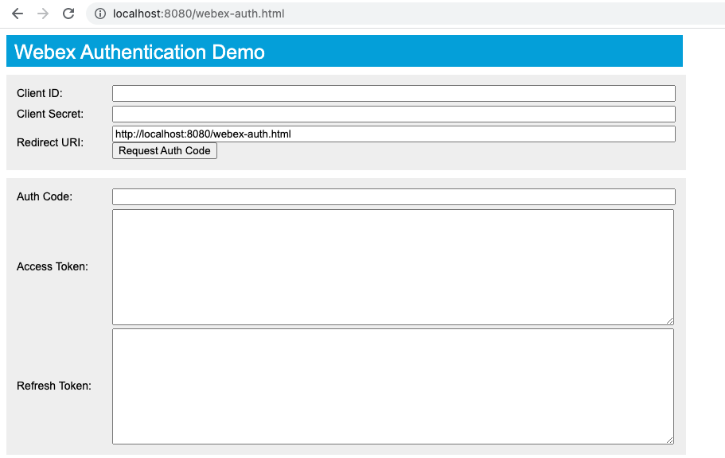

## Generating an OAuth2 User Access Token

This projects seeks to demonstrate how to request an OAuth2 user access token for use with the Webex API. We will request this token for usage with our Webex Out of Office bot from the proceeding folder. In doing this, we will create and register an application as a Webex Integration.

This code accompanies the [Understanding the OAuth Flow of a Webex Integration](https://developer.cisco.com/learning/lab/collab-spark-auth/step/1) learning lab at [https://developer.cisco.com/learning/](https://developer.cisco.com/learning/)





## Getting Started

Let's first register an application as an 'Integration' at [https://developer.webex.com/my-apps](https://developer.webex.com/my-apps). Fill out all fields except redirect URI(s) and Scopes.

- **Will this integration use a mobile SDK:** No
- **Integration Name:** Enter any application name you like (e.g., 'test app')
- **Contact Email:** Enter your email address
- **Icon:** Upload an icon image or choose one of the defaults (note the size requirements)
- **Description:** Enter any description you like

Let's now focus on the two remaining fields.

Scope will limit the information the OAuth2 user token you generate will have access to. Briefly review the types of information available. For our out of office bot, we will only select *spark:messages_read* for awareness when users direct message us.

The URI(s) field will be the address a user is redirected to upon completion of the OAuth flow. We will specify the URI of our local application here. Since we will be hosting a local web page on our local endpoint, enter in this line *http://localhost:8080/webex-auth.html*. Finish creating the integration by selecting *Add Integration* at the bottom of the form.

 Now let's start our locally hosted web page that will facilitate our OAuth2 user access token workflow. In the terminal, run

```
npx http-server
```

and navigate to the web page *http://localhost:8080/webex-auth.html*. Enter the Client ID of the application you just registered. Select *Request Auth Code*. At this point, a string will be returned in the *Auth Code* field. Now re-renter the client ID, in addition to the client secret, from your registered application. Select *Request Access Token*.

You will now have an OAuth2 user access token that can be used with your Webex Out of Office bot, as well as a Refresh token.
