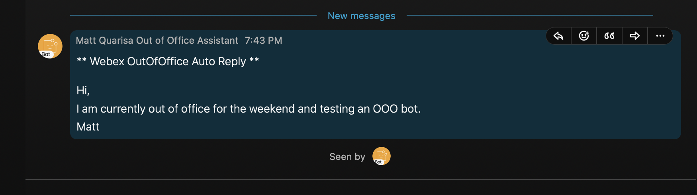

## Webex Out of Office Bot

For detailed instructions and commentary on code provided here, please see [Yossi Meloch's blog titled: Do More With Webex Out of Office Auto Reply](https://blogs.cisco.com/developer/webexoutofofficeautoreply01). A brief guide to get started will be provided below.


## Getting Started

To get started, let's create a config file to store your Personal and Bot API credentials.

Create a file in this folder titled *config.cfg* with entrys below:

```
[webex]
webex_personal_token=XYZ
webex_bot_token=ABC
```

Recall that your Webex bot token was provided when creating your bot. A personal Webex API token can either be found via [requesting a developer access token](https://developer.webex.com/docs/getting-started), or by requesting an OAuth2 user token. Please note that a developer access token is active **only for 24 hours**, at which point, it will need to be renewed. An OAuth2 user token has a **14 day duration**, as well as a refresh token valid for 90 days. Please see the [OAuth flow](/webex-ooo-notice/OAuth-flow) folder for details on how to request an OAuth2 user token.

Please also see [detailed reading on Webex API access tokens](https://developer.cisco.com/learning/modules/webex-extensibility-sd/collab-webex-security-itp/step/2) for more information on delineating these types of tokens.  

You should now have your bot token and either the [developer access token](https://developer.webex.com/docs/getting-started) or a [OAuth2 user token](/webex-ooo-notice/OAuth-flow) mentioned above. Replace the values of *XYZ* and *ABC* with your developer / OAuth2 token and bot tokens, respectively.

Feel free to customize your out of office message! You can find this specified on line 109 of the *Webex_OOO.py* file. There are also comments in this file explaining the purpose of different functions.

You can now run via

```
python3 webex_OOO.py
```
Now let's test! Try creating a Webex account with a new email, and messaging yourself. You should receive a response from your out of office bot! If you would like to have this run even when your laptop is shutdown, try migrating this code over to a raspberry pi and running there.


